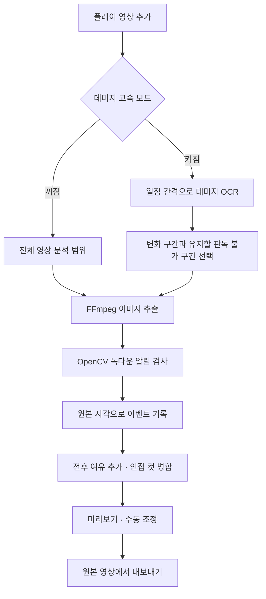

# Apex Highlights

**Apex Legends 플레이 영상에서 녹다운 장면을 찾아 하이라이트 컷을 만드는 Windows 프로그램입니다.**

긴 녹화 영상을 일일이 확인하고 자르는 작업을 줄이기 위해 만들었습니다. 화면의 녹다운 알림을 감지해 발생 시각을 기록하고, 그 앞뒤를 편집 구간으로 구성합니다. 감지된 장면을 미리보기로 확인하고 필요한 부분을 수정한 뒤 개별 영상이나 합본으로 내보낼 수 있습니다.

영상 분석과 내보내기는 로컬 PC에서 수행합니다. 초기 패키지 설치와 OCR 모델 다운로드에는 인터넷 연결이 필요합니다.

## 주요 기능

| 기능 | 설명 |
|---|---|
| 녹다운 자동 감지 | 한글 녹다운 기준 이미지와 알림 영역을 비교해 발생 시각 기록 |
| 추출과 동시 검사 | FFmpeg로 PNG를 추출하면서 저장이 끝난 이미지부터 OpenCV로 검사 |
| 자동 컷 구성 | 이벤트 전후 길이 설정, 인접 구간 병합, 수동 구간 추가·수정·삭제 |
| 미리보기 | 구간 재생과 가벼운 미리보기 영상 사용 옵션 |
| 데미지 고속 모드 | 우측 상단 누적 데미지 변화로 녹다운 검사 범위를 줄이는 선택 기능 |
| 내보내기 | 구간별 개별 영상 또는 하나로 이어 붙인 합본 출력 |
| 출력 설정 | FHD·QHD·4K, 원본·30·60·120 FPS, 출력 폴더 이름 지정 |
| 프로젝트 저장 | 분석·편집 작업을 JSON으로 저장하고 다시 불러오기 |

파일을 창으로 끌어 놓아 추가할 수 있고, 추출 설정에는 기본값 복원 버튼이 있습니다. 같은 영상과 분석 설정으로 완료한 결과는 캐시에서 다시 불러올 수 있습니다.

## 처리 흐름



기본 분석은 **초당 2장, 가로 최대 1280의 PNG**를 사용합니다. 한 장에서 인식 기준을 만족하면 후보로 등록하고, 같은 알림이 연속으로 감지되면 묶습니다. 검사한 임시 이미지는 정리하며, 내보내기는 원본 영상을 사용합니다.

GPU 디코딩은 D3D11을 사용하고, 해당 추출이 실패하면 CPU로 다시 시도합니다. 처리 시간은 영상 길이·해상도·코덱·저장 장치·GPU에 따라 달라집니다.

## 실행 환경

| 항목 | 요구 사항 |
|---|---|
| 운영체제 | Windows |
| Python | 3.12, 64비트, `py` 실행 관리자 포함 |
| Python 패키지 | `requirements.txt`를 통해 설치 |
| 데미지 고속 모드 | Tesseract OCR, 영어 언어 데이터(`eng`), EasyOCR 모델 |
| GPU | 선택 사항. D3D11 디코딩을 지원하면 사용 가능 |

FFmpeg 실행 파일은 `imageio-ffmpeg` 패키지에 포함됩니다. 기본 기준 이미지 감지는 OCR 모델 없이도 사용할 수 있습니다.

> 개발 PC 환경에서 편집기 기동과 분석 연동을 확인했습니다. 새 PC에서 설치 과정 전체를 검증한 상태는 아닙니다.

## 설치 및 실행

### 1. 소스 받기

저장소를 내려받아 원하는 폴더에 압축을 풀거나 Git으로 복제합니다. 아래 명령은 `README.md`가 있는 저장소 루트를 기준으로 실행합니다.

### 2. 실행 환경 설치

Python 3.12를 설치한 뒤 **`Setup.cmd`**를 실행합니다. 설치 과정은 다음과 같습니다.

1. 저장소 안에 `.venv` 가상환경 생성
2. `requirements.txt`의 패키지 설치
3. EasyOCR 모델 다운로드
4. `Start-ApexHighlights.lnk` 실행 바로가기 생성

모델 다운로드를 나중에 진행하려면 PowerShell에서 다음과 같이 설치합니다.

```powershell
./setup.ps1 -SkipModels
```

나중에 OCR 모델을 준비할 때는 다음 명령을 사용합니다.

```powershell
./.venv/Scripts/python.exe prepare_models.py
```

### 3. 데미지 OCR 준비 — 고속 모드 사용 시

Tesseract OCR과 영어 언어 데이터(`eng`)를 별도로 설치합니다. 실행 파일을 PATH에 등록하거나 아래 기본 경로를 사용하세요.

```text
C:/Program Files/Tesseract-OCR/tesseract.exe
```

다른 위치에 설치했다면 환경 변수 `TESSERACT_CMD`에 실행 파일의 전체 경로를 지정할 수 있습니다. Tesseract와 OCR 모델 바이너리는 저장소에 포함하지 않습니다.

### 4. 프로그램 실행

**`Start-ApexHighlights.lnk`**를 실행합니다. 프로그램 실행 시 콘솔 창은 표시하지 않습니다. PowerShell에서 직접 실행할 수도 있습니다.

```powershell
./.venv/Scripts/pythonw.exe launch.pyw
```

폴더를 옮긴 뒤 바로가기가 작동하지 않으면 새 위치에서 실행 환경을 다시 설치하세요. Python 가상환경은 이동 가능한 배포 파일이 아닙니다.

## 사용 방법

### 영상 추가 및 분석

1. **파일 추가**를 누르거나 영상 파일을 창으로 끌어 놓습니다.
2. 기본 감지 방법은 **기준 이미지**, 감지 대상은 **녹다운**입니다.
3. 필요한 경우 미리보기에서 녹다운 알림이 뜨는 시점으로 이동해 **알림 영역 지정**을 사용합니다.
4. **클립 전체 분석**을 실행합니다.
5. 분석이 끝나면 **추출 구간** 목록에서 결과를 확인합니다.

기본 제공 기준 이미지는 한글 녹다운 알림용입니다. 게임 언어, 화면 비율, HUD 배치가 다른 경우 감지 영역이나 기준 이미지 보정이 필요할 수 있습니다.

### 컷 확인 및 수정

구간을 선택해 재생하고 시작·끝 시각을 조정합니다. 누락된 장면은 수동으로 추가하고 불필요한 구간은 삭제할 수 있습니다.

이벤트 전후 길이나 병합 간격만 바꿨다면 **현재 결과로 컷 길이 다시 계산**을 사용합니다. 감지 시각을 다시 찾는 영상 분석과 컷 길이 계산은 구분되어 있습니다.

### 내보내기 및 프로젝트 저장

출력 해상도·프레임률·폴더 이름을 정한 뒤 **개별 내보내기** 또는 **합본 내보내기**를 선택합니다. 합본은 현재 컷 목록의 구간을 하나의 영상으로 만듭니다.

작업을 나중에 이어가려면 **프로젝트 저장**을 사용합니다. 프로젝트는 원본 영상 자체를 포함하지 않으므로 다시 열 때 원본 파일이 해당 경로에 있어야 합니다.

## 기본 설정

| 설정 | 기본값 | 의미 |
|---|---:|---|
| 초당 분석 화면 수 | 2장 | 0.5초 간격의 화면 검사 |
| 이벤트 이전 | 6.5초 | 감지된 알림 시작 전 포함할 길이 |
| 이벤트 이후 | 1초 | 같은 알림이 마지막으로 감지된 시점 이후 포함할 길이 |
| 구간 병합 간격 | 3초 | 서로 가까운 컷을 하나로 합치는 기준 |
| 인식 기준 | 0.8 | 기준 이미지 비교 점수의 기준이며 정확도 확률은 아님 |
| 감지 방법 | 기준 이미지 | 기본 한글 녹다운 템플릿 사용 |
| 데미지 고속 모드 | 꺼짐 | 선택적으로 활성화 |
| 판독 불가도 제외 | 꺼짐 | 판단할 수 없는 구간을 기본 유지 |
| 출력 | FHD · 60 FPS | 내보내기 설정에서 변경 가능 |

저장된 프로젝트를 열면 해당 프로젝트의 설정을 사용합니다. 기본값 버튼으로 필요한 설정만 복원할 수 있습니다.

## 데미지 고속 모드

녹다운이 일어나지 않았을 것으로 판단되는 구간을 먼저 제외하는 기능입니다. 왼쪽 추출 설정을 아래로 스크롤해 **고속 모드 · 데미지 변화**를 켭니다.

### 구간 판정

1. 기본 1분 간격으로 화면 우측 상단의 누적 데미지를 읽습니다.
2. 양 끝 데미지가 같은 구간은 10초 간격으로 추가 확인합니다.
3. 앞뒤 데미지가 같으면 중간의 판독 불가를 연결해 제외합니다.
4. 데미지가 증가하거나 감소한 구간은 남깁니다.
5. 남은 구간에 앞뒤 여유를 추가하고 기존 녹다운 검사를 실행합니다.

| 판독 예시 | 처리 |
|---|---|
| `634 → 634` | 같은 데미지 구간으로 묶어 제외 |
| `634 → 판독 불가 → 634` | 앞뒤 동일로 연결해 제외 |
| `634 → 판독 불가 → 800` | 변화가 일어난 구간이므로 유지 |
| `800 → 100` | 경기 전환 또는 변화 구간으로 유지 |
| 앞뒤 값까지 확인할 수 없음 | 기본 유지. **판독 불가도 제외**를 켜면 제외 |

**판독 불가도 제외를 켜도 앞뒤 데미지가 다른 구간은 유지합니다.** 인벤토리로 HUD가 가려지는 경우 등에도 앞뒤 동일 규칙을 적용합니다. 보완한 값은 실제 OCR 결과를 덮어쓰지 않고 추정값으로 따로 기록합니다.

### 영역 지정과 기록 확인

- **데미지 영역 지정:** 숫자가 보이는 시점에서 우측 상단 데미지 표시를 감쌉니다. 다른 통계나 FPS 표시는 제외하세요.
- **영역 기본값:** 데미지 인식 영역을 초기 위치로 복원합니다.
- **데미지 판독 기록 열기:** 선택한 영상의 OCR 이미지와 CSV/JSON 기록을 확인합니다.

실제로 녹다운 검사를 수행한 범위는 판독 기록 폴더의 `editor_windows.json`에 저장합니다.

현재 고속 모드는 **기준 이미지 감지**에 적용합니다. 문자 인식 또는 문자+이미지 감지를 선택하면 전체 분석으로 진행합니다. 데미지 필터 준비·실행이 실패한 경우에도 전체 분석으로 전환하며, 사용자가 취소한 작업은 중단합니다.

## 결과 파일과 저장 위치

기본 실행 데이터는 `apps/ApexHighlights/data/` 아래에 저장됩니다. 내보낸 영상과 편집 프로젝트의 위치는 사용자가 선택합니다.

| 파일·폴더 | 내용 |
|---|---|
| `data/analysis/` | 분석 결과 캐시와 데미지 판독 기록 |
| `data/previews/` | 가벼운 미리보기용 영상 |
| `damage_samples.csv` | 원본 시각별 OCR 값, 구간 판단값, 추정 여부와 근거 시각 |
| `intervals.csv` | 데미지 구간별 판정 |
| `editor_windows.json` | 고속 모드에서 실제 검사한 구간 |
| `data/last_error.txt` | 편집기 작업 실패 시 오류 기록 |
| `data/startup_error.txt` | 시작 과정에서 실패한 경우 오류 기록 |

OCR 모델은 사용자 EasyOCR 캐시 또는 앱의 분석 데이터 폴더에 저장될 수 있습니다. 문자 인식 모드를 처음 선택할 때 추가 모델 다운로드가 발생할 수 있습니다.

## 현재 한계

- HUD·글꼴·해상도·압축 상태·배경 밝기에 따라 녹다운 감지나 데미지 OCR이 누락·오독될 수 있습니다. 내보내기 전에 결과를 확인하세요.
- 고속 모드는 샘플 사이의 경기 전환이나 변화를 모두 확인하지 못합니다. 같은 영상에서 일반 모드 결과와 비교할 수 있습니다.
- 고속 모드가 항상 빠른 것은 아닙니다. 제외할 구간이 적으면 사전 OCR 비용 때문에 오히려 느려질 수 있습니다.
- 현재 기준 이미지 감지는 최소 비교 점수 0.8을 적용합니다. UI에서 그보다 낮은 값을 설정해도 이미지 감지 기준은 0.8 아래로 내려가지 않습니다.
- 높은 출력 해상도나 FPS를 선택해도 원본에 없는 화질이나 움직임이 복원되지는 않습니다.

## 프로젝트 구성

```text
.
├── apps/
│   └── ApexHighlights/
│       ├── assets/              # 한글 녹다운 기준 이미지와 UI 자산
│       ├── profiles/            # 기본 분석 프로필
│       ├── qt_app.py            # 편집기 UI
│       ├── core.py              # 이벤트·컷 구성·내보내기
│       ├── pipeline_analyzer.py # PNG 추출과 녹다운 동시 검사
│       ├── damage_fast.py       # 데미지 필터와 편집기 연결
│       ├── damage_filter.py     # 데미지 OCR과 구간 판정
│       └── preview.py           # 미리보기 재생
├── launch.pyw                   # 콘솔 없는 실행 진입점
├── prepare_models.py            # OCR 모델 준비
├── requirements.txt             # Python 의존성
├── Setup.cmd
├── setup.ps1                    # 설치와 바로가기 생성
└── .gitignore
```

주요 기술은 Python, PySide6, FFmpeg, OpenCV, Tesseract, EasyOCR/PyTorch입니다. 이 저장소에는 편집 프로그램과 실행에 필요한 자산만 포함합니다. 원본 영상, 개인 설정, 분석 결과, 가상환경, OCR 모델 및 개발용 실험 도구는 포함하지 않습니다.

개인 영상과 편집 프로젝트는 저장소 밖에 저장하세요. `.gitignore`는 실행 중 생성되는 캐시·결과·모델·로그와 로컬 실행 바로가기 등을 제외하도록 구성되어 있습니다.
